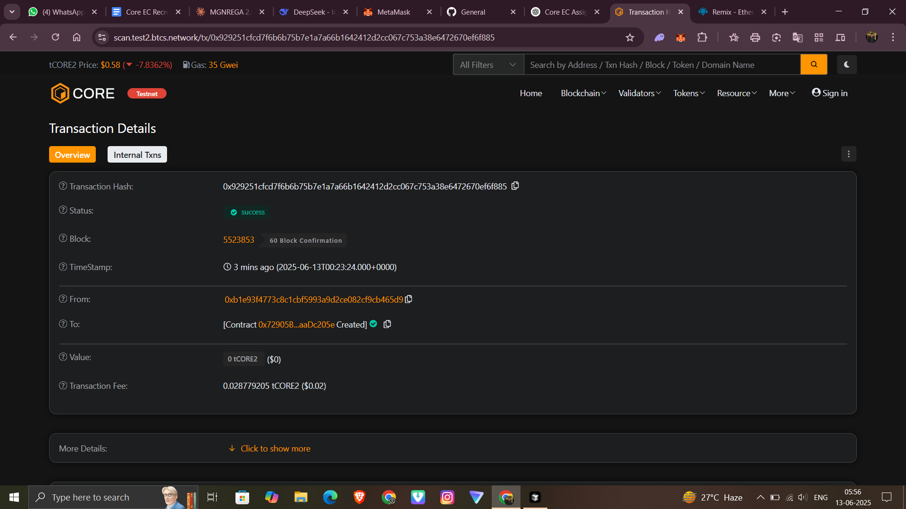

# PlagCheckChain – Anti-Plagiarism for Code Submissions

> ✅ Deployed on: Core Testnet  
> 📬 Contract Address: `0x72905b4f187c9aec1601caa912e00f4caadc205e`  
> 🔗 Explorer: [View on Core Testnet](https://scan.test2.btcs.network/address/0xYOUR_CONTRACT_ADDRESS_HERE)  
> 🧾 Tx Hash: `0x929251cfcd7f6b6b75b7e1a7a66b1642412d2cc067c753a38e6472670ef6f885`  
> 📸 Screenshot below

---

## 📌 Project Description

PlagCheckChain is a decentralized solution that enables students to submit code assignments in a tamper-proof and transparent way. It stores cryptographic hashes of code submissions on the blockchain to detect duplicates and prevent plagiarism.

---

## 🎯 Project Vision

To promote academic integrity and transparency by:
- Ensuring code originality among students
- Enabling instructors to verify code ownership using blockchain timestamps
- Creating an open, auditable submission log

---

## ⚙️ Key Features

- ✅ Submit hashed code with assignment name
- 🔍 Detect duplicate submissions via `checkIfDuplicate()`
- 🕒 Timestamped records for submission validation
- 🔐 Immutable and transparent logs stored on-chain

---

## 🔮 Future Scope

- 🔗 IPFS integration to optionally store actual code
- 📊 Admin panel for real-time plagiarism alerts
- 🧠 AI-based similarity scoring on frontend
- 🎓 Faculty-only dashboard to filter students

---

## 🧪 Example Use Case

1. Student A submits code `"print('Hello')"` for Assignment 1 → hash stored
2. Student B tries submitting same code → flagged as duplicate
3. Instructor reviews timestamp and student address to decide action

---

## 📷 Transaction Screenshot

---

## 📁 Project Structure

# GenericMedicinePriceTracker
PlagCheckChain/
├── Contracts/
│ └── PlagCheckChain.sol
├── README.md
└── tx_screenshot.png

---

## 🚀 Deployment Details

- Remix IDE  
- Compiler: `v0.8.26`  
- Environment: `Injected Provider - MetaMask`  
- Network: Core Testnet

---

## ✍️ Author

**Vishal**  
BTech | AIML | Oriental College Of Technology Bhopal  
